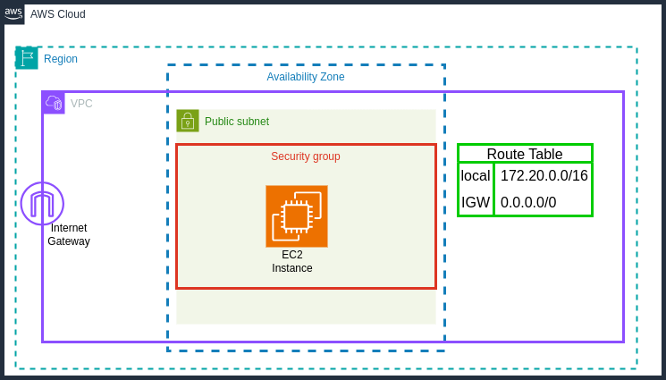

## How to create VPC, Internet-gateway, Subnets, Security and ec2 instance using AWS Boto3 Library 

The *aws_boto3_tutorial.py*  scripts can be used to quickly spin up a AWS test environment: The script creates a VPC network, with an internet-gateway attached to it, a route-table associated with a subnets on specific availability zone, a security-group that allows inbound traffic on port 80, 443 and 22, and finally an EC2 instance to deploy and test your application. The EC2 launched in this tutorial is a t2.micro instance type with an Ubuntu 22.04 LTS image. The resources can be cleaned up after test is complete to prevent charges by running the *cleanup.py* .

## Resource

- [AWS Boto3 Documentation](https://boto3.amazonaws.com/v1/documentation/api/latest/index.html)
